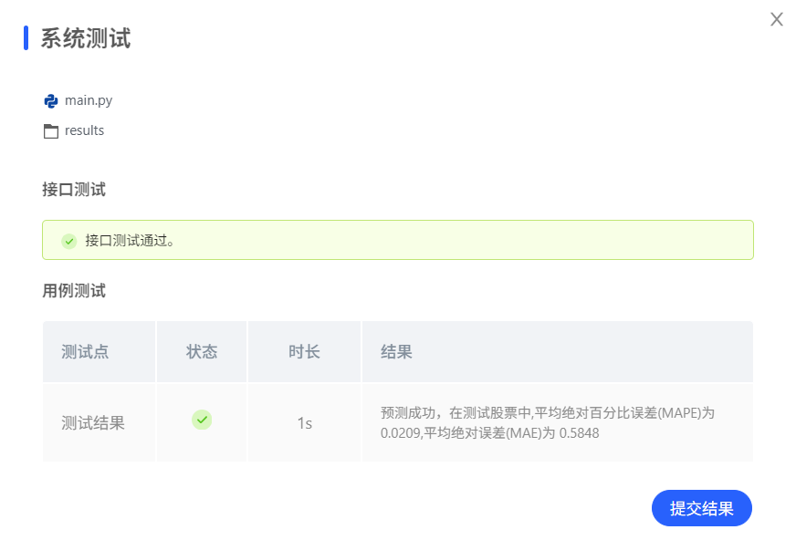
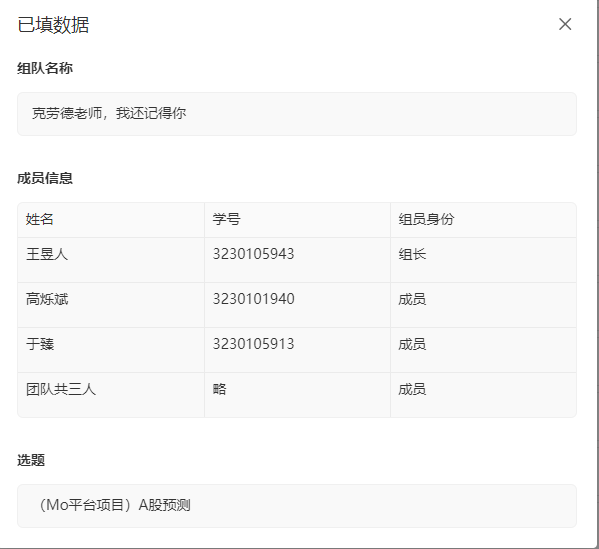

## 结果

测试结果1s，预测成功，在测试股票中,平均绝对百分比误差(MAPE)为 0.0209,平均绝对误差(MAE)为 0.5848。

## pre建议 其中我的注释跟在//后面
@所有人 中期PPT提纲 建议

一、封面：汇报基本信息
课题名称 /
团队名称 / 成员姓名与学号 
// 
汇报日期 // 7.13

二、课题背景与目标（~1页）
要解决什么问题：用通俗语言说明课题的现实意义或学术价值
现有方法或同类工作的不足（简要，1-2点即可）
本课题的目标：明确最终要交付的结果（如模型、系统原型、实验报告等）
预期创新点（与传统方法或现有方案相比）

// 因为直接输出前一天的结果大于很多lstm的预测 所以显然想要预测股票不可能只盯着数据看 我们需要相关的新闻等等 所以我们的创新点便是agent

三、已完成的工作（核心部分，~3-4页）//这部分分两个 LSTM模型和agent部分 
1. 数据与资源准备
数据集来源、规模、标注情况、预处理方式
是否使用预训练模型/开源工具/硬件平台
数据划分（训练/验证/测试）说明

2. 技术方案与实现
整体流程图（数据处理 → 模型训练 → 评估/部署）
所选模型/算法简述（名称、结构、输入输出）
关键模块实现说明（可配代码框架图/类图）
平台环境

3. 当前阶段性结果
已跑通的基础模型或Baseline结果
如有初步实验，给出关键指标（Accuracy/F1/mAP/Loss曲线等），可配图展示
对初步结果做简要分析（符合预期/不符合预期/原因推测）

四、遇到的问题与解决方案（~1-2页）// LSTM效果还不如纯输出前几天的
技术难点：如模型收敛慢、显存不足、数据不均衡、部署延时等
协作问题：如接口对接、代码版本管理等
已采取的解决措施及效果
尚未解决的问题及计划应对策略

五、后续工作计划（~1-2页）// LSTM部分需要去深入挖掘影响因子，增加一些有用的辅助信息，如宏观经济指标，减少一些冗余的特征时间节点；agent部分

列出从中期到结题的关键里程碑
重点攻关方向：优化模型精度/推理加速/前端展示/增加对比实验等
任务分工调整（如有必要）
预期最终成果：模型权重、演示系统、代码仓库、实验报告/论文等

汇报时长建议：PPT 8分钟以内
原则：实事求是，展示思考过程而非只堆砌结果；强调“从0到1”的实践进展和真实困难。